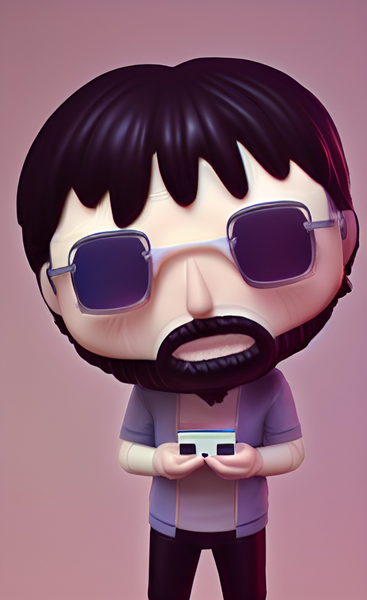

  

<h1 align="center">
  Hi there 👋
</h1> 

### :man_technologist: About Me :

I am junior Python Developer from Russia:
- :telescope: I’m working as a Software Engineer
- :seedling: Learning the basics of Python, also Django and Django Rest Framework
---

### :hammer_and_wrench: Languages and Tools :

  &nbsp;
  &nbsp;
  &nbsp;
  &nbsp;
  

---

### :fire: My Stats :

  

  

     
📫 How to reach me: 

    
    
  

  

